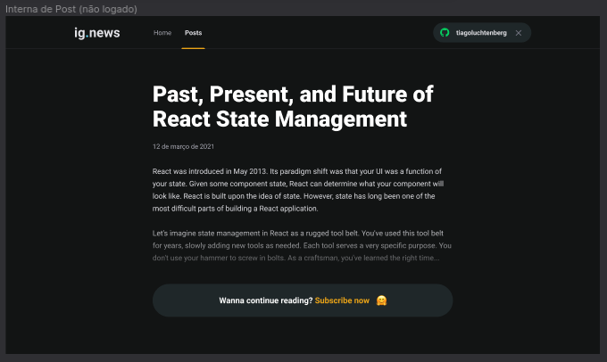

# ig.news

News subscription application using ReactJS developed in the Rocketseat Ignite course using stripe as a test payment method.

## Screenshots

<div align="center" id="top"> 
  
</div>
<br/>
<br/>
<div align="center" id="top"> 
  
</div>
<br/>
<br/>
<div align="center" id="top"> 
  
</div>
<br/>
<br/>
<div align="center" id="top"> 
  
</div>
<br/>
<br/>

```bash
# Clone this project
$ git clone https://github.com/ewertonspezia/ignews

# Access
$ cd ignews

# Install dependencies
$ yarn

# Adjusting variables in the .env.local file
$ Copy .env.local.example to .env.local and fill the variables

# Stripe listen execute
$ stripe listen --forward-to localhost:3000/api/webhooks

# Run the project
$ yarn dev

# The server will initialize in the <http://localhost:3000>
```
